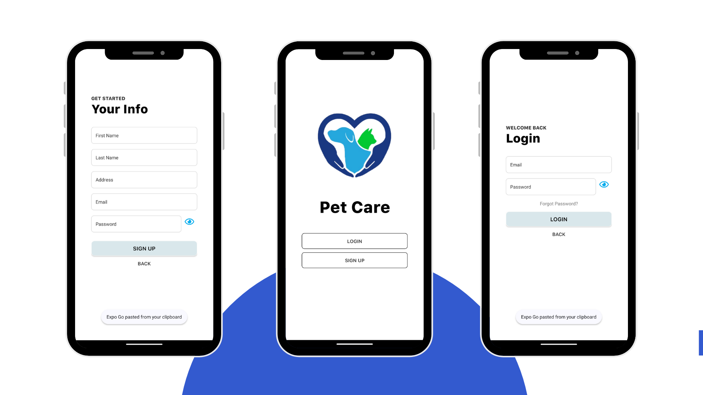
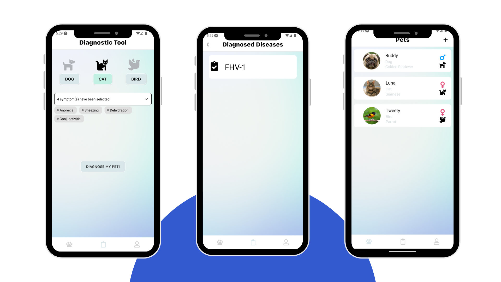

# PetCare App 🐾

Welcome to the **PetCare App**, a mobile app built with love for pet owners! Whether you're a new pet parent or just looking to streamline your pet care routine, PetCare has got your back. From feeding schedules to health tracking and locating veterinarians, we've thought of everything you need to keep your furry friend happy and healthy. 🐶🐱

---

## Table of Contents 📚

- [Features](#features)
- [Interfaces](#interfaces)
- [Installation](#installation)
- [Setup](#setup)
- [Usage](#usage)
- [Technologies](#technologies)
- [License](#license)

---

## Features ✨

- **Feeding Schedule Management**: Keep your pet's feeding times and quantities logged with ease! 🥣
- **Food and Water Levels**: Check water levels 💦 at any time and dispense random treats to your pet!
- **Health Tracking**: Record and track your pet's health progress, including feeding logs and more! 💪
- **Veterinarian Locator**: Find nearby veterinarians and keep your pet's health in top shape! 🐾
- **Admin Panel**: Admins can create and manage veterinarian accounts to help others care for their pets. 🐕‍⚕️
- **User Authentication**: Safe and secure login and password recovery features. 🔑
- **Firebase Integration**: Real-time sync for your pet care needs, so everything stays up-to-date. 🛠️

---

## Interfaces 📱

1. **User Authentication**:  
   Login, register interfaces  
   

2. **User Profile**:  
   Update user profile details, sign out, delete, and reset password  
   

3. **Add Pet**:  
   Log in your pet details such as name, species, feeding times and quantities, activity level, etc.  
   

4. **Consult Pet Details**:  
   View pet details such as name, species, feeding logs, dispense treats, and consult water levels  
   

5. **Health Tracking**:  
   Record and track your pet's health progress, including training videos, diets, and prescriptions! 💪  
   

6. **Diagnose Pet**:  
   Choose symptoms and self-diagnose your pet  
   

7. **Admin View**:  
   View users and create vet accounts  
   

8. **Veterinarian View**:  
   Diagnose pets and suggest diets 🐾  
   

---

## Installation 🚀

Ready to get started? Here's how to set up your PetCare App locally! 🌱

1. **Clone the Repository**:

   ```bash
   git clone https://github.com/SemerNahdi/pettify.git
   ```

2. **Navigate to Your Project Folder**:

   ```bash
   cd pet-care-v3
   ```

3. **Install Dependencies**:

   ```bash
   npm install
   ```

4. **Firebase Setup**:

   - Go to [Firebase Console](https://console.firebase.google.com/) and create a new Firebase project.
   - Add Firebase SDK configuration to your app (in `firebase.js` or a similar file).

---

## Setup 🔧

1. **Firebase Configuration**:

   - Ensure your Firebase project is ready, and add your Firebase credentials into the app's Firebase setup file.

2. **First-Time Setup**:

   - The first time you run the app, **comment out the data injection code** located in `src/components/Firebase.js`. This code initializes the disease information data for the pet diagnosis feature and creates an admin account in Firebase.
   - **Important**: Change the default password before deploying for security purposes.
   - **Note**: After running the app for the first time, comment out the data injection code to avoid issues with Firebase in future runs.

3. **Admin Account**:

   - The admin account created with the default credentials is the only one that can create vet accounts. You can create additional admin accounts through Firebase, but it's recommended to **keep the number of admins minimal** to ensure security and proper management.

4. **Creating Test Data**:
   The app includes a function `createTestData()` to populate Firebase with test data:

   - **Test User**: `testuser@example.com`, password: `testpassword`
   - **Test Veterinarian**: `vetuser@example.com`, password: `vetpassword`
   - **Admin Account**: `ad@min.com`, password: `temp123`

   **Important**: Run this function **only once** during the initial setup, then comment out the code to prevent data injection in future app runs.

---

## Running the App with Expo 🚀

To run the PetCare app using Expo, follow these steps:

1. **Start the App**:

   Run the app with Expo using the following command:

   ```bash
   expo start
   ```

   Alternatively, you can use:

   ```bash
   yarn start
   ```

   or

   ```bash
   npm start
   ```

2. **If Expo Doesn't Start**:

   If Expo doesn't automatically start the app, you can create a new Expo app and start it by running the following command:

   ```bash
   expo init pet-care
   ```

   This will initialize a new Expo project, which can be started using the `expo start` command.

---

## Technologies 🛠️

Here's the tech that powers PetCare:

- **React Native**: For building the app and delivering a smooth, responsive experience across platforms.
- **Expo**: To streamline development and provide extra tooling for building mobile apps.
- **Firebase**: For real-time data storage and user authentication—keeping your data safe and synced.

---

## License 📜

This project is licensed under the MIT License. See the [LICENSE.md](LICENSE.md) file for more details.
